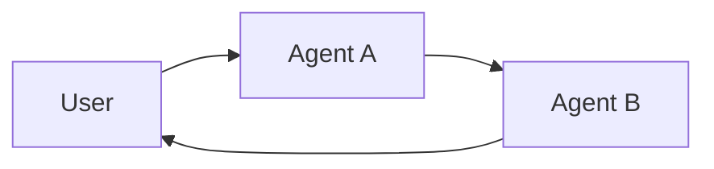

**多智能体系统**将复杂应用分解为多个专业智能体，这些智能体协同工作以解决问题。
与依赖单一智能体处理每个步骤不同，**多智能体架构**允许你将更小、更专注的智能体组合成一个协调的工作流。

多智能体系统在以下情况下特别有用：

* 单个智能体拥有过多工具，导致在选择使用哪个工具时做出糟糕决策。
* 上下文或记忆变得过于庞大，单个智能体难以有效跟踪。
* 任务需要**专业化**（例如，规划师、研究员、数学专家）。

## 多智能体模式

| 模式                           | 工作原理                                                                                                                                                     | 控制流                                               | 示例用例                                 |
|-----------------------------------|--------------------------------------------------------------------------------------------------------------------------------------------------------------------------------------------------|------------------------------------------------------------|--------------------------------------------------|
| [**工具调用**](#tool-calling) | **监督者**智能体将其他智能体作为*工具*进行调用。"工具"智能体不直接与用户对话——它们只执行任务并返回结果。                  | 集中式：所有路由都通过调用智能体。 | 任务编排，结构化工作流。        |
| [**控制权移交**](#handoffs)         | 当前智能体决定将**控制权转移**给另一个智能体。活跃智能体发生变更，用户可能继续直接与新智能体交互。 | 去中心化：智能体可以变更活跃智能体。            | 多领域对话，专家接管。 |

<Card
    title="教程：构建监督者智能体"
    icon="sitemap"
    href="/oss/python/langchain/supervisor"
    arrow cta="了解更多"
>
    学习如何使用监督者模式构建个人助手，其中一个中央监督者智能体协调专业的工作者智能体。
    本教程演示：
    * 为不同领域（日历和电子邮件）创建专门的子智能体
    * 将子智能体包装为工具以实现集中编排
    * 为敏感操作添加人工介入审查
</Card>

## 选择模式

| 问题                                              | 工具调用 | 控制权移交 |
|-------------------------------------------------------|--------------|----------|
| 需要对工作流进行集中控制？               | ✅ 是        | ❌ 否     |
| 希望智能体直接与用户交互？       | ❌ 否         | ✅ 是    |
| 需要专家间进行复杂、类人的对话？ | ❌ 有限    | ✅ 强 |

<Tip>
    你可以混合使用这两种模式——使用**控制权移交**进行智能体切换，并让每个智能体将**子智能体作为工具调用**以处理专业任务。
</Tip>

## 自定义智能体上下文

多智能体设计的核心是**上下文工程**——决定每个智能体能看到哪些信息。LangChain 让你可以细粒度地控制：

* 对话或状态的哪些部分传递给每个智能体。
* 为子智能体量身定制的专用提示。
* 中间推理过程的包含/排除。
* 每个智能体的自定义输入/输出格式。

你的系统质量**在很大程度上取决于**上下文工程。目标是确保每个智能体在执行任务时，无论是作为工具还是活跃智能体，都能访问到所需的正確数据。

## 工具调用

在**工具调用**模式中，一个智能体（"**控制器**"）将其他智能体视为需要时调用的*工具*。控制器负责编排，而工具智能体执行特定任务并返回结果。

流程：

1. **控制器**接收输入并决定调用哪个工具（子智能体）。
2. **工具智能体**根据控制器的指令运行其任务。
3. **工具智能体**将结果返回给控制器。
4. **控制器**决定下一步或结束流程。

```mermaid
graph LR
    A[User] --> B[Controller Agent]
    B --> C[Tool Agent 1]
    B --> D[Tool Agent 2]
    C --> B
    D --> B
    B --> E[User Response]
````

<Tip>
    作为工具使用的智能体通常**不期望**与用户继续对话。
    它们的角色是执行任务并将结果返回给控制器智能体。
    如果你需要子智能体能够与用户对话，请改用**控制权移交**模式。
</Tip>

### 实现

下面是一个最小示例，其中主智能体通过工具定义获得对一个子智能体的访问权限：

```python
from langchain.tools import tool
from langchain.agents import create_agent


subagent1 = create_agent(model="...", tools=[...])

@tool(
    "subagent1_name",
    description="subagent1_description"
)
def call_subagent1(query: str):
    result = subagent1.invoke({
        "messages": [{"role": "user", "content": query}]
    })
    return result["messages"][-1].content

agent = create_agent(model="...", tools=[call_subagent1])
```


在此模式中：
1. 当主智能体认为任务与子智能体的描述匹配时，它会调用 `call_subagent1`。
2. 子智能体独立运行并返回其结果。
3. 主智能体接收结果并继续编排。

### 可自定义之处

你可以在多个节点控制主智能体与其子智能体之间的上下文传递：

1. **子智能体名称** (`"subagent1_name"`)：这是主智能体引用子智能体的方式。由于它影响提示，请仔细选择。
2. **子智能体描述** (`"subagent1_description"`)：这是主智能体对该子智能体的"了解"。它直接影响主智能体决定何时调用它。
3. **传递给子智能体的输入**：你可以自定义此输入，以更好地塑造子智能体对任务的解读。在上面的示例中，我们直接传递了智能体生成的 `query`。
4. **子智能体的输出**：这是传回给主智能体的**响应**。你可以调整返回的内容，以控制主智能体如何解读结果。在上面的示例中，我们返回了最终消息的文本，但你可以返回额外的状态或元数据。

### 控制传递给子智能体的输入

控制主智能体传递给子智能体的输入有两个主要手段：

* **修改提示**——调整主智能体的提示或工具元数据（即子智能体的名称和描述），以更好地指导其何时以及如何调用子智能体。
* **上下文注入**——通过调整工具调用以从智能体状态中提取信息，添加那些无法通过静态提示捕获的输入（例如，完整的消息历史、先前的结果、任务元数据）。

```python
from langchain.agents import AgentState
from langchain.tools import tool, ToolRuntime

class CustomState(AgentState):
    example_state_key: str

@tool(
    "subagent1_name",
    description="subagent1_description"
)
def call_subagent1(query: str, runtime: ToolRuntime[None, CustomState]):
    # Apply any logic needed to transform the messages into a suitable input
    subagent_input = some_logic(query, runtime.state["messages"])
    result = subagent1.invoke({
        "messages": subagent_input,
        # You could also pass other state keys here as needed.
        # Make sure to define these in both the main and subagent's
        # state schemas.
        "example_state_key": runtime.state["example_state_key"]
    })
    return result["messages"][-1].content
```


### 控制子智能体的输出

塑造主智能体从子智能体接收到的内容的两种常见策略：

* **修改提示**——优化子智能体的提示，明确规定应返回什么内容。
  * 当输出不完整、过于冗长或缺少关键细节时非常有用。
  * 一个常见的失败模式是子智能体执行了工具调用或推理，但**没有在最终消息中包含结果**。提醒它，控制器（和用户）只能看到最终输出，因此所有相关信息必须包含在那里。
* **自定义输出格式**——在将子智能体的响应交还给主智能体之前，通过代码调整或丰富它。
  * 示例：除了最终文本外，还将特定的状态键传回给主智能体。
  * 这需要将结果包装在 [`Command`](https://reference.langchain.com/python/langgraph/types/#langgraph.types.Command)（或等效结构）中，以便你可以将自定义状态与子智能体的响应合并。

```python
from typing import Annotated
from langchain.agents import AgentState
from langchain.tools import InjectedToolCallId
from langgraph.types import Command


@tool(
    "subagent1_name",
    description="subagent1_description"
)
# We need to pass the `tool_call_id` to the sub agent so it can use it to respond with the tool call result
def call_subagent1(
    query: str,
    tool_call_id: Annotated[str, InjectedToolCallId],
# You need to return a `Command` object to include more than just a final tool call
) -> Command:
    result = subagent1.invoke({
        "messages": [{"role": "user", "content": query}]
    })
    return Command(update={
        # This is the example state key we are passing back
        "example_state_key": result["example_state_key"],
        "messages": [
            ToolMessage(
                content=result["messages"][-1].content,
                # We need to include the tool call id so it matches up with the right tool call
                tool_call_id=tool_call_id
            )
        ]
    })
```


## 控制权移交

在**控制权移交**模式中，智能体可以直接将控制权传递给彼此。"活跃"智能体发生变更，用户与当前拥有控制权的任何智能体交互。

流程：

1. **当前智能体**决定需要另一个智能体的帮助。
2. 它将控制权（和状态）传递给**下一个智能体**。
3. **新智能体**直接与用户交互，直到它决定再次移交控制权或结束任务。



### 实现（即将推出）

---

<Callout icon="pen-to-square" iconType="regular">
    [Edit the source of this page on GitHub.](https://github.com/langchain-ai/docs/edit/main/src/oss/langchain/multi-agent.mdx)
</Callout>
<Tip icon="terminal" iconType="regular">
    [Connect these docs programmatically](/use-these-docs) to Claude, VSCode, and more via MCP for    real-time answers.
</Tip>
