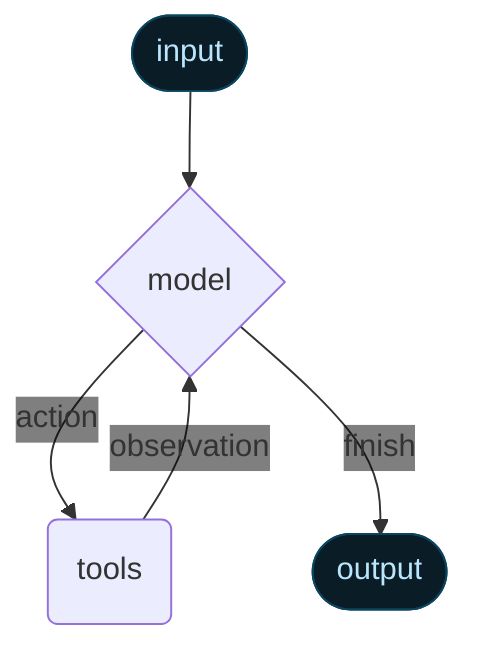

代理将语言模型与[工具](/oss/langchain/tools)相结合，创建能够推理任务、决定使用哪些工具并迭代式寻找解决方案的系统。

:::python
@[`create_agent`] 提供了一个生产就绪的代理实现。
:::
:::js
`createAgent()` 提供了一个生产就绪的代理实现。
:::

[LLM 代理通过循环运行工具来实现目标](https://simonwillison.net/2025/Sep/18/agents/)。
代理会持续运行，直到满足停止条件——即模型发出最终输出或达到迭代限制。



<Info>

:::python
@[`create_agent`] 使用 [LangGraph](/oss/langgraph/overview) 构建基于**图**的代理运行时。图由节点（步骤）和边（连接）组成，定义了代理处理信息的方式。代理在此图中移动，执行诸如模型节点（调用模型）、工具节点（执行工具）或中间件等节点。
:::
:::js
`createAgent()` 使用 [LangGraph](/oss/langgraph/overview) 构建基于**图**的代理运行时。图由节点（步骤）和边（连接）组成，定义了代理处理信息的方式。代理在此图中移动，执行诸如模型节点（调用模型）、工具节点（执行工具）或中间件等节点。
:::

了解更多关于 [Graph API](/oss/langgraph/graph-api) 的信息。

</Info>

## 核心组件

### 模型

[模型](/oss/langchain/models) 是代理的推理引擎。可以通过多种方式指定，支持静态和动态模型选择。

#### 静态模型

静态模型在创建代理时配置一次，并在整个执行过程中保持不变。这是最常见且直接的方法。

从 <Tooltip tip="遵循格式 `provider:model` 的字符串（例如 openai:gpt-5）" cta="查看映射" href="https://reference.langchain.com/python/langchain/models/#langchain.chat_models.init_chat_model(model_provider)">模型标识符字符串</Tooltip> 初始化静态模型：

:::python
```python wrap
from langchain.agents import create_agent

agent = create_agent(
    "openai:gpt-5",
    tools=tools
)
```
:::
:::js
```ts wrap
import { createAgent } from "langchain";

const agent = createAgent({
  model: "openai:gpt-5",
  tools: []
});
```
:::

:::python
<Tip>
    模型标识符字符串支持自动推断（例如，`"gpt-5"` 将被推断为 `"openai:gpt-5"`）。参考 @[reference][init_chat_model(model_provider)] 查看完整的模型标识符字符串映射列表。
</Tip>

为了更精细地控制模型配置，可以直接使用提供者包初始化模型实例。在此示例中，我们使用 @[`ChatOpenAI`]。查看 [聊天模型](/oss/integrations/chat) 了解其他可用的聊天模型类。

```python wrap
from langchain.agents import create_agent
from langchain_openai import ChatOpenAI

model = ChatOpenAI(
    model="gpt-5",
    temperature=0.1,
    max_tokens=1000,
    timeout=30
    # ... (other params)
)
agent = create_agent(model, tools=tools)
```

模型实例让您完全控制配置。当您需要设置特定的[参数](/oss/langchain/models#parameters)如 `temperature`、`max_tokens`、`timeouts`、`base_url` 和其他提供者特定设置时，请使用它们。参考[参考文档](/oss/integrations/providers/all_providers)查看模型上可用的参数和方法。
:::
:::js
模型标识符字符串使用格式 `provider:model` (例如 `"openai:gpt-5"`)。您可能希望更精细地控制模型配置，在这种情况下，您可以直接使用提供者包初始化模型实例：

```ts wrap
import { createAgent } from "langchain";
import { ChatOpenAI } from "@langchain/openai";

const model = new ChatOpenAI({
  model: "gpt-4o",
  temperature: 0.1,
  maxTokens: 1000,
  timeout: 30
});

const agent = createAgent({
  model,
  tools: []
});
```

模型实例让您完全控制配置。当您需要设置特定参数如 `temperature`、`max_tokens`、`timeouts`，或配置 API 密钥、`base_url` 和其他提供者特定设置时，请使用它们。参考 [API 参考](/oss/integrations/providers/) 查看模型上可用的参数和方法。
:::

#### 动态模型

动态模型根据当前的 <Tooltip tip="代理的执行环境，包含在代理整个执行过程中持久存在的不可变配置和上下文数据（例如，用户 ID、会话详情或应用程序特定配置）。">运行时</Tooltip> 状态和 <Tooltip tip="流经代理执行的数据，包括消息、自定义字段以及任何需要在处理过程中跟踪和可能修改的信息（例如，用户偏好或工具使用统计）。">上下文</Tooltip> 在 <Tooltip tip="运行时">runtime</Tooltip> 选择。这实现了复杂的路由逻辑和成本优化。

:::python

要使用动态模型，创建使用 @[`@wrap_model_call`] 装饰器的中间件，该中间件修改请求中的模型：

```python
from langchain_openai import ChatOpenAI
from langchain.agents import create_agent
from langchain.agents.middleware import wrap_model_call, ModelRequest, ModelResponse


basic_model = ChatOpenAI(model="gpt-4o-mini")
advanced_model = ChatOpenAI(model="gpt-4o")

@wrap_model_call
def dynamic_model_selection(request: ModelRequest, handler) -> ModelResponse:
    """基于对话复杂性选择模型。"""
    message_count = len(request.state["messages"])

    if message_count > 10:
        # 对较长的对话使用高级模型
        model = advanced_model
    else:
        model = basic_model

    request.model = model
    return handler(request)

agent = create_agent(
    model=basic_model,  # 默认模型
    tools=tools,
    middleware=[dynamic_model_selection]
)
```

<Warning>
在使用结构化输出时，不支持预绑定模型（已调用 @[`bind_tools`][BaseChatModel.bind_tools] 的模型）。如果您需要带有结构化输出的动态模型选择，请确保传递给中间件的模型不是预绑定的。
</Warning>

:::
:::js

要使用动态模型，创建带有 `wrapModelCall` 的中间件来修改请求中的模型：

```ts
import { ChatOpenAI } from "@langchain/openai";
import { createAgent, createMiddleware } from "langchain";

const basicModel = new ChatOpenAI({ model: "gpt-4o-mini" });
const advancedModel = new ChatOpenAI({ model: "gpt-4o" });

const dynamicModelSelection = createMiddleware({
  name: "DynamicModelSelection",
  wrapModelCall: (request, handler) => {
    // 基于对话复杂性选择模型
    const messageCount = request.messages.length;

    return handler({
        ...request,
        model: messageCount > 10 ? advancedModel : basicModel,
    });
  },
});

const agent = createAgent({
  model: "gpt-4o-mini", // 基础模型（当 messageCount ≤ 10 时使用）
  tools,
  middleware: [dynamicModelSelection] as const,
});
```

有关中间件和高级模式的更多详细信息，请参阅[中间件文档](/oss/langchain/middleware)。
:::

<Tip>
有关模型配置的详细信息，请参阅[模型](/oss/langchain/models)。有关动态模型选择模式，请参阅[中间件中的动态模型](/oss/langchain/middleware#dynamic-model)。
</Tip>

### 工具

工具赋予代理执行操作的能力。代理通过以下方式超越了简单的仅模型工具绑定：

- 按顺序进行多次工具调用（由单个提示触发）
- 在适当时进行并行工具调用
- 基于先前结果的动态工具选择
- 工具重试逻辑和错误处理
- 跨工具调用的状态持久性

更多信息，请参阅[工具](/oss/langchain/tools)。

#### 定义工具

向代理传递一个工具列表。

:::python
```python wrap
from langchain.tools import tool
from langchain.agents import create_agent


@tool
def search(query: str) -> str:
    """搜索信息。"""
    return f"Results for: {query}"

@tool
def get_weather(location: str) -> str:
    """获取某个位置的天气信息。"""
    return f"Weather in {location}: Sunny, 72°F"

agent = create_agent(model, tools=[search, get_weather])
```
:::
:::js
```ts wrap
import * as z from "zod";
import { createAgent, tool } from "langchain";

const search = tool(
  ({ query }) => `Results for: ${query}`,
  {
    name: "search",
    description: "搜索信息",
    schema: z.object({
      query: z.string().describe("要搜索的查询"),
    }),
  }
);

const getWeather = tool(
  ({ location }) => `Weather in ${location}: Sunny, 72°F`,
  {
    name: "get_weather",
    description: "获取某个位置的天气信息",
    schema: z.object({
      location: z.string().describe("要获取天气的位置"),
    }),
  }
);

const agent = createAgent({
  model: "openai:gpt-4o",
  tools: [search, getWeather],
});
```
:::

如果提供了空的工具列表，代理将仅包含一个没有工具调用能力的 LLM 节点。

#### 工具错误处理

:::python

要自定义工具错误的处理方式，使用 @[`@wrap_tool_call`] 装饰器创建中间件：

```python wrap
from langchain.agents import create_agent
from langchain.agents.middleware import wrap_tool_call
from langchain_core.messages import ToolMessage


@wrap_tool_call
def handle_tool_errors(request, handler):
    """使用自定义消息处理工具执行错误。"""
    try:
        return handler(request)
    except Exception as e:
        # 向模型返回自定义错误消息
        return ToolMessage(
            content=f"工具错误：请检查您的输入并重试。（{str(e)}）",
            tool_call_id=request.tool_call["id"]
        )

agent = create_agent(
    model="openai:gpt-4o",
    tools=[search, get_weather],
    middleware=[handle_tool_errors]
)
```

当工具失败时，代理将返回一个带有自定义错误消息的 @[`ToolMessage`]：

```python
[
    ...
    ToolMessage(
        content="工具错误：请检查您的输入并重试。（division by zero）",
        tool_call_id="..."
    ),
    ...
]
```

:::
:::js

要自定义工具错误的处理方式，在自定义中间件中使用 `wrapToolCall` 钩子：

```ts wrap
import { createAgent, createMiddleware, ToolMessage } from "langchain";

const handleToolErrors = createMiddleware({
  name: "HandleToolErrors",
  wrapToolCall: (request, handler) => {
    try {
      return handler(request);
    } catch (error) {
      // 向模型返回自定义错误消息
      return new ToolMessage({
        content: `工具错误：请检查您的输入并重试。（${error}）`,
        tool_call_id: request.toolCall.id!,
      });
    }
  },
});

const agent = createAgent({
  model: "openai:gpt-4o",
  tools: [
    /* ... */
  ],
  middleware: [handleToolErrors] as const,
});
```

当工具失败时，代理将返回一个带有自定义错误消息的 @[`ToolMessage`]。
:::

#### ReAct 循环中的工具使用

代理遵循 ReAct（"推理 + 行动"）模式，在简短推理步骤与针对性工具调用之间交替进行，并将结果观察反馈到后续决策中，直到能够给出最终答案。

<Accordion title="ReAct 循环示例">
提示：识别当前最流行的无线耳机并验证其可用性。

```
================================ Human Message =================================

Find the most popular wireless headphones right now and check if they're in stock
```

* **推理**："流行度是时间敏感的，我需要使用提供的搜索工具。"
* **行动**：调用 `search_products("wireless headphones")`

```
================================== Ai Message ==================================
Tool Calls:
  search_products (call_abc123)
 Call ID: call_abc123
  Args:
    query: wireless headphones
```
```
================================= Tool Message =================================

Found 5 products matching "wireless headphones". Top 5 results: WH-1000XM5, ...
```

* **推理**："在回答之前，我需要确认排名第一的商品的可用性。"
* **行动**：调用 `check_inventory("WH-1000XM5")`

```
================================== Ai Message ==================================
Tool Calls:
  check_inventory (call_def456)
 Call ID: call_def456
  Args:
    product_id: WH-1000XM5
```
```
================================= Tool Message =================================

Product WH-1000XM5: 10 units in stock
```

* **推理**："我有了最流行的型号及其库存状态。现在可以回答用户的问题了。"
* **行动**：生成最终答案

```
================================== Ai Message ==================================

I found wireless headphones (model WH-1000XM5) with 10 units in stock...
```
</Accordion>

<Tip>
要了解有关工具的更多信息，请参阅[工具](/oss/langchain/tools)。
</Tip>

### 系统提示

您可以通过提供提示来塑造代理处理任务的方式。@[`system_prompt`] 参数可以作为字符串提供：

:::python
```python wrap
agent = create_agent(
    model,
    tools,
    system_prompt="你是一个乐于助人的助手。请简洁准确。"
)
```
:::
:::js
```ts wrap
const agent = createAgent({
  model,
  tools,
  systemPrompt: "你是一个乐于助人的助手。请简洁准确。",
});
```
:::

当没有提供 @[`system_prompt`] 时，代理将直接从消息推断其任务。

#### 动态系统提示

对于需要根据运行时上下文或代理状态修改系统提示的更高级用例，您可以使用[中间件](/oss/langchain/middleware)。

:::python

@[`@dynamic_prompt`] 装饰器创建中间件，根据模型请求动态生成系统提示：

```python wrap
from typing import TypedDict

from langchain.agents import create_agent
from langchain.agents.middleware import dynamic_prompt, ModelRequest


class Context(TypedDict):
    user_role: str

@dynamic_prompt
def user_role_prompt(request: ModelRequest) -> str:
    """基于用户角色生成系统提示。"""
    user_role = request.runtime.context.get("user_role", "user")
    base_prompt = "你是一个乐于助人的助手。"

    if user_role == "expert":
        return f"{base_prompt} 提供详细的技术响应。"
    elif user_role == "beginner":
        return f"{base_prompt} 简单地解释概念，避免使用行话。"

    return base_prompt

agent = create_agent(
    model="openai:gpt-4o",
    tools=[web_search],
    middleware=[user_role_prompt],
    context_schema=Context
)

# 系统提示将根据上下文动态设置
result = agent.invoke(
    {"messages": [{"role": "user", "content": "解释机器学习"}]},
    context={"user_role": "expert"}
)
```
:::

:::js
```typescript wrap
import * as z from "zod";
import { createAgent, dynamicSystemPromptMiddleware } from "langchain";

const contextSchema = z.object({
  userRole: z.enum(["expert", "beginner"]),
});

const agent = createAgent({
  model: "openai:gpt-4o",
  tools: [/* ... */],
  contextSchema,
  middleware: [
    dynamicSystemPromptMiddleware<z.infer<typeof contextSchema>>((state, runtime) => {
      const userRole = runtime.context.userRole || "user";
      const basePrompt = "你是一个乐于助人的助手。";

      if (userRole === "expert") {
        return `${basePrompt} 提供详细的技术响应。`;
      } else if (userRole === "beginner") {
        return `${basePrompt} 简单地解释概念，避免使用行话。`;
      }
      return basePrompt;
    }),
  ],
});

// 系统提示将根据上下文动态设置
const result = await agent.invoke(
  { messages: [{ role: "user", content: "解释机器学习" }] },
  { context: { userRole: "expert" } }
);
```
:::

<Tip>
有关消息类型和格式的更多详细信息，请参阅[消息](/oss/langchain/messages)。有关全面的中间件文档，请参阅[中间件](/oss/langchain/middleware)。
</Tip>

## 调用

您可以通过向其 [`State`](/oss/langgraph/graph-api#state) 传递更新来调用代理。所有代理在其状态中都包含一个[消息序列](/oss/langgraph/use-graph-api#messagesstate)；要调用代理，请传递一条新消息：

:::python
```python
result = agent.invoke(
    {"messages": [{"role": "user", "content": "旧金山的天气怎么样？"}]}
)
```
:::
:::js
```typescript
await agent.invoke({
  messages: [{ role: "user", content: "旧金山的天气怎么样？" }],
})
```
:::

要从代理流式传输步骤和/或令牌，请参阅[流式传输](/oss/langchain/streaming)指南。

除此之外，代理遵循 LangGraph 的 [Graph API](/oss/langgraph/use-graph-api) 并支持所有相关方法。

## 高级概念

### 结构化输出

:::python

在某些情况下，您可能希望代理以特定格式返回输出。LangChain 通过 @[`response_format`][ModelRequest(response_format)] 参数提供了结构化输出的策略。

#### ToolStrategy

`ToolStrategy` 使用人工工具调用来生成结构化输出。这适用于任何支持工具调用的模型：

```python wrap
from pydantic import BaseModel
from langchain.agents import create_agent
from langchain.agents.structured_output import ToolStrategy


class ContactInfo(BaseModel):
    name: str
    email: str
    phone: str

agent = create_agent(
    model="openai:gpt-4o-mini",
    tools=[search_tool],
    response_format=ToolStrategy(ContactInfo)
)

result = agent.invoke({
    "messages": [{"role": "user", "content": "从以下内容提取联系信息：John Doe, john@example.com, (555) 123-4567"}]
})

result["structured_response"]
# ContactInfo(name='John Doe', email='john@example.com', phone='(555) 123-4567')
```

#### ProviderStrategy

`ProviderStrategy` 使用模型提供程序的原生结构化输出生成。这更可靠，但仅适用于支持原生结构化输出的提供程序（例如，OpenAI）：

```python wrap
from langchain.agents.structured_output import ProviderStrategy

agent = create_agent(
    model="openai:gpt-4o",
    response_format=ProviderStrategy(ContactInfo)
)
```

<Note>
从 `langchain 1.0` 开始，不再支持仅传递模式（例如 `response_format=ContactInfo`）。您必须明确使用 `ToolStrategy` 或 `ProviderStrategy`。
</Note>

:::
:::js
在某些情况下，您可能希望代理以特定格式返回输出。LangChain 通过 `responseFormat` 参数提供了一种简单、通用的方法来实现这一点。

```ts wrap
import * as z from "zod";
import { createAgent } from "langchain";

const ContactInfo = z.object({
  name: z.string(),
  email: z.string(),
  phone: z.string(),
});

const agent = createAgent({
  model: "openai:gpt-4o",
  responseFormat: ContactInfo,
});

const result = await agent.invoke({
  messages: [
    {
      role: "user",
      content: "从以下内容提取联系信息：John Doe, john@example.com, (555) 123-4567",
    },
  ],
});

console.log(result.structuredResponse);
// {
//   name: 'John Doe',
//   email: 'john@example.com',
//   phone: '(555) 123-4567'
// }
```
:::
<Tip>
要了解结构化输出，请参阅[结构化输出](/oss/langchain/structured-output)。
</Tip>

### 记忆

代理通过消息状态自动维护对话历史记录。您还可以配置代理使用自定义状态模式来记住对话过程中的附加信息。

存储在状态中的信息可以看作是代理的[短期记忆](/oss/langchain/short-term-memory)：

:::python

自定义状态模式必须将 @[`AgentState`] 扩展为 `TypedDict`。

有两种定义自定义状态的方式：
1. 通过[中间件](/oss/langchain/middleware)（推荐）
2. 通过 @[`create_agent`] 上的 @[`state_schema`]

<Note>
通过中间件定义自定义状态比通过 @[`create_agent`] 上的 @[`state_schema`] 定义更受推荐，因为它允许您将状态扩展概念上限定在相关的中间件和工具范围内。

@[`state_schema`] 在 @[`create_agent`] 上仍然受支持以保持向后兼容性。
</Note>

#### 通过中间件定义状态

当您的自定义状态需要被特定的中间件钩子和附加到该中间件的工具访问时，使用中间件来定义自定义状态。

```python
from langchain.agents import AgentState
from langchain.agents.middleware import AgentMiddleware


class CustomState(AgentState):
    user_preferences: dict

class CustomMiddleware(AgentMiddleware):
    state_schema = CustomState
    tools = [tool1, tool2]

    def before_model(self, state: CustomState, runtime) -> dict[str, Any] | None:
        ...

agent = create_agent(
    model,
    tools=tools,
    middleware=[CustomMiddleware()]
)

# 代理现在可以跟踪消息之外的附加状态
result = agent.invoke({
    "messages": [{"role": "user", "content": "我偏好技术性解释"}],
    "user_preferences": {"style": "technical", "verbosity": "detailed"},
})
```

#### 通过 `state_schema` 定义状态

使用 @[`state_schema`] 参数作为快捷方式来定义仅用于工具中的自定义状态。

```python
from langchain.agents import AgentState


class CustomState(AgentState):
    user_preferences: dict

agent = create_agent(
    model,
    tools=[tool1, tool2],
    state_schema=CustomState
)
# 代理现在可以跟踪消息之外的附加状态
result = agent.invoke({
    "messages": [{"role": "user", "content": "我偏好技术性解释"}],
    "user_preferences": {"style": "technical", "verbosity": "detailed"},
})
```

<Note>
从 `langchain 1.0` 开始，自定义状态模式**必须**是 `TypedDict` 类型。不再支持 Pydantic 模型和数据类。有关更多详细信息，请参阅 [v1 迁移指南](/oss/migrate/langchain-v1#state-type-restrictions)。
</Note>

:::
:::js
```ts wrap
import * as z from "zod";
import { MessagesZodState } from "@langchain/langgraph";
import { createAgent, type BaseMessage } from "langchain";

const customAgentState = z.object({
  messages: MessagesZodState.shape.messages,
  userPreferences: z.record(z.string(), z.string()),
});

const CustomAgentState = createAgent({
  model: "openai:gpt-4o",
  tools: [],
  stateSchema: customAgentState,
});
```
:::

<Tip>
要了解更多关于记忆的信息，请参阅[记忆](/oss/concepts/memory)。有关实现跨会话持久化的长期记忆的信息，请参阅[长期记忆](/oss/langchain/long-term-memory)。
</Tip>

### 流式传输

我们已经看到可以使用 `invoke` 调用代理以获取最终响应。如果代理执行多个步骤，这可能需要一段时间。为了显示中间进度，我们可以在消息发生时将其流式传输回来。

:::python
```python
for chunk in agent.stream({
    "messages": [{"role": "user", "content": "搜索 AI 新闻并总结发现"}]
}, stream_mode="values"):
    # 每个块包含该时间点的完整状态
    latest_message = chunk["messages"][-1]
    if latest_message.content:
        print(f"代理: {latest_message.content}")
    elif latest_message.tool_calls:
        print(f"调用工具: {[tc['name'] for tc in latest_message.tool_calls]}")
```
:::
:::js
```ts
const stream = await agent.stream(
  {
    messages: [{
      role: "user",
      content: "搜索 AI 新闻并总结发现"
    }],
  },
  { streamMode: "values" }
);

for await (const chunk of stream) {
  // 每个块包含该时间点的完整状态
  const latestMessage = chunk.messages.at(-1);
  if (latestMessage?.content) {
    console.log(`代理: ${latestMessage.content}`);
  } else if (latestMessage?.tool_calls) {
    const toolCallNames = latestMessage.tool_calls.map((tc) => tc.name);
    console.log(`调用工具: ${toolCallNames.join(", ")}`);
  }
}
```
:::

<Tip>
有关流式传输的更多详细信息，请参阅[流式传输](/oss/langchain/streaming)。
</Tip>

### 中间件

[中间件](/oss/langchain/middleware) 提供了强大的扩展性，用于在执行的不同阶段自定义代理行为。您可以使用中间件来：

- 在调用模型之前处理状态（例如，消息修剪、上下文注入）
- 修改或验证模型的响应（例如，防护栏、内容过滤）
- 使用自定义逻辑处理工具执行错误
- 基于状态或上下文实现动态模型选择
- 添加自定义日志记录、监控或分析

中间件无缝集成到代理的执行图中，允许您在关键点拦截和修改数据流，而无需更改核心代理逻辑。

:::python
<Tip>
有关包括 @[`@before_model`]、@[`@after_model`] 和 @[`@wrap_tool_call`] 等装饰器的全面中间件文档，请参阅[中间件](/oss/langchain/middleware)。
</Tip>
:::

:::js
<Tip>
有关包括 `beforeModel`、`afterModel` 和 `wrapToolCall` 等钩子的全面中间件文档，请参阅[中间件](/oss/langchain/middleware)。
</Tip>
:::
