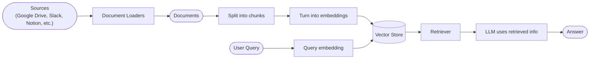
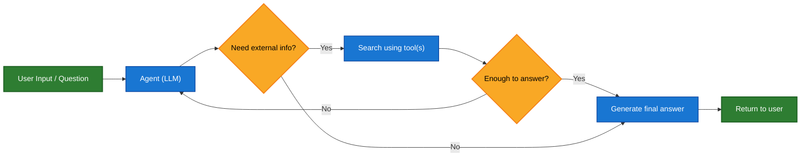
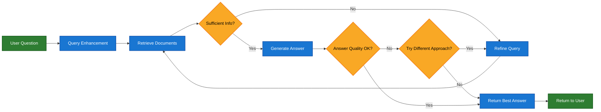

大型语言模型（LLMs）功能强大，但它们有两个关键限制：

* **有限的上下文** — 它们无法一次性摄入整个语料库。
* **静态知识** — 它们的训练数据在某个时间点是冻结的。

检索通过在查询时获取相关的外部知识来解决这些问题。这是**检索增强生成** 的基础：用特定上下文的信息来增强 LLM 的答案。


## 构建知识库

**知识库** 是在检索过程中使用的文档或结构化数据的存储库。

如果你需要自定义知识库，可以使用 LangChain 的文档加载器和向量存储库，从你自己的数据构建一个。

<Note>
    如果你已经有一个知识库（例如，SQL 数据库、CRM 或内部文档系统），你**不需要**重建它。你可以：
    - 将其作为**工具**连接给 Agentic RAG 中的智能体使用。
    - 查询它并将检索到的内容作为上下文提供给 LLM [（2-Step RAG）](#2-step-rag)。
</Note>

请参阅以下教程，构建一个可搜索的知识库和最小化的 RAG 工作流：

<Card
    title="教程：语义搜索"
    icon="database"
    href="/oss/langchain/knowledge-base"
    arrow cta="了解更多"
>
    学习如何使用 LangChain 的文档加载器、嵌入和向量存储库，从你自己的数据创建一个可搜索的知识库。
    在本教程中，你将构建一个基于 PDF 的搜索引擎，实现检索与查询相关的段落。你还将在此引擎之上实现一个最小化的 RAG 工作流，以了解外部知识如何整合到 LLM 的推理中。
</Card>

### 从检索到 RAG

检索使得 LLMs 能够在运行时访问相关上下文。但大多数现实世界的应用更进一步：它们**将检索与生成相结合**，以产生有根据的、具有上下文感知能力的答案。

这就是**检索增强生成** 背后的核心理念。检索管道成为一个更广泛系统的基础，该系统将搜索与生成相结合。

### 检索管道

一个典型的检索工作流如下所示：



每个组件都是模块化的：你可以更换加载器、分割器、嵌入模型或向量存储库，而无需重写应用程序的逻辑。

### 构建模块

<Columns cols={2}>
    <Card
        title="Document loaders"
        icon="file-import"
        href="/oss/integrations/document_loaders"
        arrow cta="Learn more"
    >
        从外部源（Google Drive, Slack, Notion 等）摄取数据，返回标准化的 @[`Document`] 对象。
    </Card>

    :::python
    <Card
        title="Text splitters"
        icon="scissors"
        href="/oss/integrations/splitters"
        arrow
        cta="Learn more"
    >
        将大型文档分解为较小的块，这些块可以单独检索并适应模型的上下文窗口。
    </Card>
    :::
    <Card
        title="Embedding models"
        icon="diagram-project"
        href="/oss/integrations/text_embedding"
        arrow
        cta="Learn more"
    >
        嵌入模型将文本转换为数字向量，使得含义相似的文本在该向量空间中位置接近。
    </Card>

    <Card
        title="Vector stores"
        icon="database"
        href="/oss/integrations/vectorstores/"
        arrow
        cta="Learn more"
    >
        用于存储和搜索嵌入的专用数据库。
    </Card>

    <Card
        title="Retrievers"
        icon="binoculars"
        href="/oss/integrations/retrievers/"
        arrow
        cta="Learn more"
    >
        检索器是一个接口，它根据非结构化查询返回文档。
    </Card>
</Columns>

## RAG 架构

RAG 可以通过多种方式实现，具体取决于你系统的需求。我们在下面各部分中概述了每种类型。

| 架构             | 描述                                                                 | 控制度    | 灵活性      | 延迟          | 示例用例                                   |
|------------------|----------------------------------------------------------------------|-----------|-------------|---------------|--------------------------------------------|
| **2-Step RAG**   | 检索总是在生成之前发生。简单且可预测                                   | ✅ 高      | ❌ 低        | ⚡ 快速        | 常见问题解答，文档机器人                   |
| **Agentic RAG**  | 一个由 LLM 驱动的智能体决定在推理过程中*何时*以及*如何*进行检索         | ❌ 低      | ✅ 高        | ⏳ 可变        | 可以访问多个工具的研究助手                 |
| **Hybrid**       | 结合了两种方法的特点，并包含验证步骤                                   | ⚖️ 中等   | ⚖️ 中等     | ⏳ 可变        | 带有质量验证的特定领域问答                 |

<Info>
**延迟**：在 **2-Step RAG** 中，延迟通常更**可预测**，因为 LLM 调用的最大次数是已知且有上限的。这种可预测性假设 LLM 推理时间是主导因素。然而，实际延迟也可能受到检索步骤性能的影响——例如 API 响应时间、网络延迟或数据库查询——这些性能可能因所使用的工具和基础设施而异。
</Info>

### 2-step RAG

在 **2-Step RAG** 中，检索步骤总是在生成步骤之前执行。这种架构简单直接且可预测，适用于许多需要先明确检索相关文档再生成答案的应用场景。


<Card
    title="教程：检索增强生成"
    icon="robot"
    href="/oss/langchain/rag#rag-chains"
    arrow cta="了解更多"
>
    了解如何构建一个问答聊天机器人，它可以使用检索增强生成来回答基于你数据的问题。
    本教程介绍了两种方法：
    * 一个使用灵活工具运行搜索的 **RAG 智能体**——非常适合通用场景。
    * 一个每个查询只需要一次 LLM 调用的 **2-step RAG** 链——对于较简单的任务来说快速高效。
</Card>

### Agentic RAG

**Agentic Retrieval-Augmented Generation** 结合了检索增强生成和基于智能体的推理的优势。它不是在回答之前检索文档，而是由一个智能体（由 LLM 驱动）进行逐步推理，并在交互过程中决定**何时**以及**如何**检索信息。

<Tip>
智能体启用 RAG 行为唯一需要的是访问一个或多个可以获取外部知识的**工具**——例如文档加载器、Web API 或数据库查询。
</Tip>



:::python
```python
import requests
from langchain.tools import tool
from langchain.chat_models import init_chat_model
from langchain.agents import create_agent


@tool
def fetch_url(url: str) -> str:
    """Fetch text content from a URL"""
    response = requests.get(url, timeout=10.0)
    response.raise_for_status()
    return response.text

system_prompt = """\
Use fetch_url when you need to fetch information from a web-page; quote relevant snippets.
"""

agent = create_agent(
    model="claude-sonnet-4-0",
    tools=[fetch_url], # A tool for retrieval [!code highlight]
    system_prompt=system_prompt,
)
```
:::

:::js
```typescript
import { tool, createAgent, initChatModel } from "langchain";

const fetchUrl = tool(
    (url: string) => {
        return `Fetched content from ${url}`;
    },
    { name: "fetch_url", description: "Fetch text content from a URL" }
);

const agent = createAgent({
    model: "claude-sonnet-4-0",
    tools: [fetchUrl],
    systemPrompt,
});
```
:::

<Expandable title="扩展示例：用于 LangGraph llms.txt 的 Agentic RAG">

此示例实现了一个 **Agentic RAG 系统**，以帮助用户查询 LangGraph 文档。智能体首先加载 [llms.txt](https://llmstxt.org/)，其中列出了可用的文档 URL，然后可以根据用户的问题动态使用 `fetch_documentation` 工具来检索和处理相关内容。

:::python
```python
import requests
from langchain.agents import create_agent
from langchain.messages import HumanMessage
from langchain.tools import tool
from markdownify import markdownify


ALLOWED_DOMAINS = ["https://langchain-ai.github.io/"]
LLMS_TXT = 'https://langchain-ai.github.io/langgraph/llms.txt'


@tool
def fetch_documentation(url: str) -> str:  # [!code highlight]
    """Fetch and convert documentation from a URL"""
    if not any(url.startswith(domain) for domain in ALLOWED_DOMAINS):
        return (
            "Error: URL not allowed. "
            f"Must start with one of: {', '.join(ALLOWED_DOMAINS)}"
        )
    response = requests.get(url, timeout=10.0)
    response.raise_for_status()
    return markdownify(response.text)


# We will fetch the content of llms.txt, so this can
# be done ahead of time without requiring an LLM request.
llms_txt_content = requests.get(LLMS_TXT).text

# System prompt for the agent
system_prompt = f"""
You are an expert Python developer and technical assistant.
Your primary role is to help users with questions about LangGraph and related tools.

Instructions:

1. If a user asks a question you're unsure about — or one that likely involves API usage,
   behavior, or configuration — you MUST use the `fetch_documentation` tool to consult the relevant docs.
2. When citing documentation, summarize clearly and include relevant context from the content.
3. Do not use any URLs outside of the allowed domain.
4. If a documentation fetch fails, tell the user and proceed with your best expert understanding.

You can access official documentation from the following approved sources:

{llms_txt_content}

You MUST consult the documentation to get up to date documentation
before answering a user's question about LangGraph.

Your answers should be clear, concise, and technically accurate.
"""

tools = [fetch_documentation]

model = init_chat_model("claude-sonnet-4-0", max_tokens=32_000)

agent = create_agent(
    model=model,
    tools=tools,  # [!code highlight]
    system_prompt=system_prompt,  # [!code highlight]
    name="Agentic RAG",
)

response = agent.invoke({
    'messages': [
        HumanMessage(content=(
            "Write a short example of a langgraph agent using the "
            "prebuilt create react agent. the agent should be able "
            "to look up stock pricing information."
        ))
    ]
})

print(response['messages'][-1].content)
```
:::
:::js
```typescript
import { tool, createAgent, initChatModel, HumanMessage } from "langchain";
import * as z from "zod";

const ALLOWED_DOMAINS = ["https://langchain-ai.github.io/"];
const LLMS_TXT = "https://langchain-ai.github.io/langgraph/llms.txt";

const fetchDocumentation = tool(
  async (input) => {  // [!code highlight]
    if (!ALLOWED_DOMAINS.some((domain) => input.url.startsWith(domain))) {
      return `Error: URL not allowed. Must start with one of: ${ALLOWED_DOMAINS.join(", ")}`;
    }
    const response = await fetch(input.url);
    if (!response.ok) {
      throw new Error(`HTTP error! status: ${response.status}`);
    }
    return response.text();
  },
  {
    name: "fetch_documentation",
    description: "Fetch and convert documentation from a URL",
    schema: z.object({
      url: z.string().describe("The URL of the documentation to fetch"),
    }),
  }
);

const llmsTxtResponse = await fetch(LLMS_TXT);
const llmsTxtContent = await llmsTxtResponse.text();

const systemPrompt = `
You are an expert TypeScript developer and technical assistant.
Your primary role is to help users with questions about LangGraph and related tools.

Instructions:

1. If a user asks a question you're unsure about — or one that likely involves API usage,
   behavior, or configuration — you MUST use the \`fetch_documentation\` tool to consult the relevant docs.
2. When citing documentation, summarize clearly and include relevant context from the content.
3. Do not use any URLs outside of the allowed domain.
4. If a documentation fetch fails, tell the user and proceed with your best expert understanding.

You can access official documentation from the following approved sources:

${llmsTxtContent}

You MUST consult the documentation to get up to date documentation
before answering a user's question about LangGraph.

Your answers should be clear, concise, and technically accurate.
`;

const tools = [fetchDocumentation];

const agent = createAgent({
  model: "claude-sonnet-4-0"
  tools,  // [!code highlight]
  systemPrompt,  // [!code highlight]
  name: "Agentic RAG",
});

const response = await agent.invoke({
  messages: [
    new HumanMessage(
      "Write a short example of a langgraph agent using the " +
      "prebuilt create react agent. the agent should be able " +
      "to look up stock pricing information."
    ),
  ],
});

console.log(response.messages.at(-1)?.content);
```
:::
</Expandable>

<Card
    title="教程：检索增强生成"
    icon="robot"
    href="/oss/langchain/rag"
    arrow cta="了解更多"
>
    了解如何构建一个问答聊天机器人，它可以使用检索增强生成来回答基于你数据的问题。
    本教程介绍了两种方法：
    * 一个使用灵活工具运行搜索的 **RAG 智能体**——非常适合通用场景。
    * 一个每个查询只需要一次 LLM 调用的 **2-step RAG** 链——对于较简单的任务来说快速高效。
</Card>

### Hybrid RAG

Hybrid RAG 结合了 2-Step RAG 和 Agentic RAG 的特点。它引入了中间步骤，例如查询预处理、检索验证和后生成检查。这些系统比固定管道提供更多灵活性，同时保持对执行的一定控制。

典型组件包括：

* **查询增强**：修改输入问题以提高检索质量。这可能涉及重写不明确的查询、生成多个变体或用附加上下文扩展查询。
* **检索验证**：评估检索到的文档是否相关和充分。如果不是，系统可能会优化查询并重新检索。
* **答案验证**：检查生成的答案的准确性、完整性以及与源内容的一致性。如果需要，系统可以重新生成或修改答案。

该架构通常支持这些步骤之间的多次迭代：



这种架构适用于：

* 具有模糊或未充分说明查询的应用程序
* 需要验证或质量控制步骤的系统
* 涉及多个来源或迭代优化的流程

<Card
    title="教程：具有自我纠正功能的 Agentic RAG"
    icon="robot"
    href="/oss/langgraph/agentic-rag"
    arrow cta="了解更多"
>
    一个 **Hybrid RAG** 的示例，它结合了智能体推理、检索和自我纠正。
</Card>
